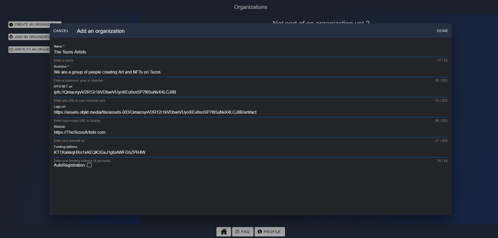
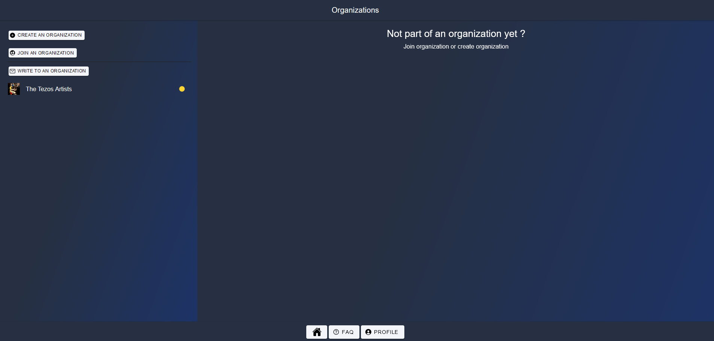
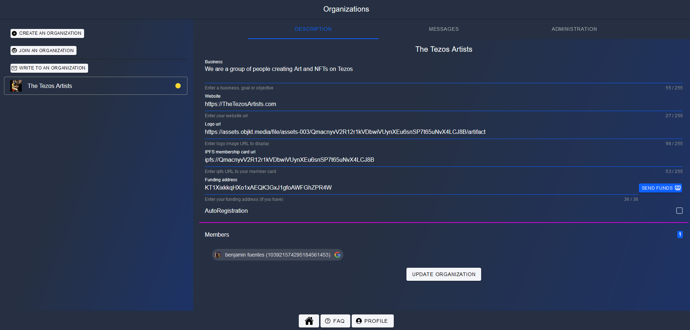
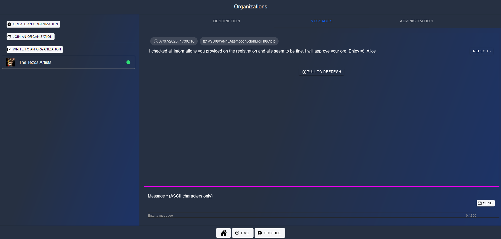

# Create an organization

On **Home/Organizations** menu, click on **CREATE AN ORGANIZATION** and fill the form then click on **DONE** button

Confirm the transaction with your wallet, and wait few seconds for refresh

- name : The name of your organization
- business : The goal or business of your org
- IPFS NFT url (optional): the link to your org NFT
- Logo url (optional): the picture / logo
- Website (optional): the link to your website
- Funding address (optional): the address to your DAO or a user wallet address for sending funds
- AutoRegistration (optional): if you authorize or not member to join automatically without manual approval. Default is false

If you click on it, it is selected and you have access to different tabs

> Note : your organization is still on pending mode until a super admin will look at it and do a short KYC with you. When this process is accepted, you will be able to accept new members, etc ...
> Note : You will have to behave as a good father/mother and not have an unappropriated behavior. If members reports so, your organization might be frozen during a certain time. Apart of this, super admins have no control on what you do on your organization.

## Update

As administrator of your org, you can update all the fields and click **UPDATE ORGANIZATION**

## Messages

You can vizualize here all alerts/messages sent to your organization

For more information on how to send message, got to this [chapter](WriteToAnOrganization.md)

## Administration

The last tab is where you manage your organization, go to this [chapter](ManageAnOrganization.md) to know more about it
