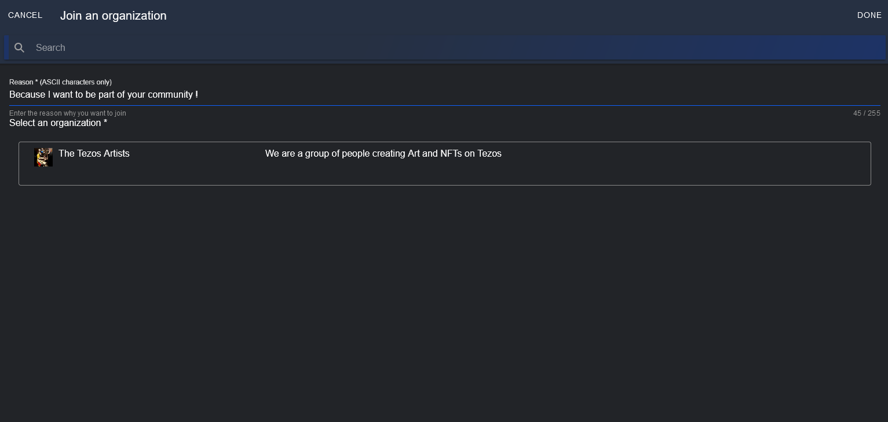

# Join an organization

Any user can request to join an organization

On home/Organization menu, click on **JOIN AN ORGANIZATION**

Fill the reason and select the organization you want to join, then click on **DONE**

Your request is sent to the administrator of this organization

To see what an administrator can do with your request , [click here](ManageAnOrganization.md#member-requests)
