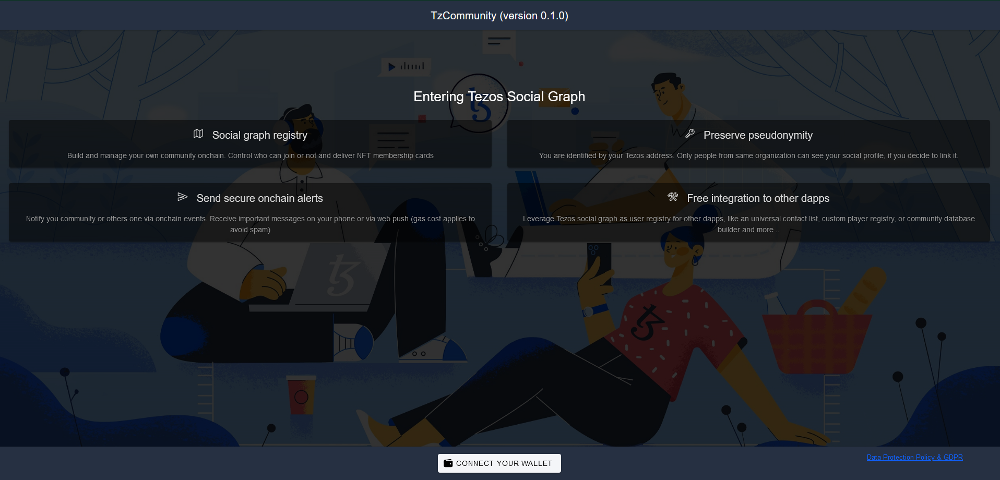
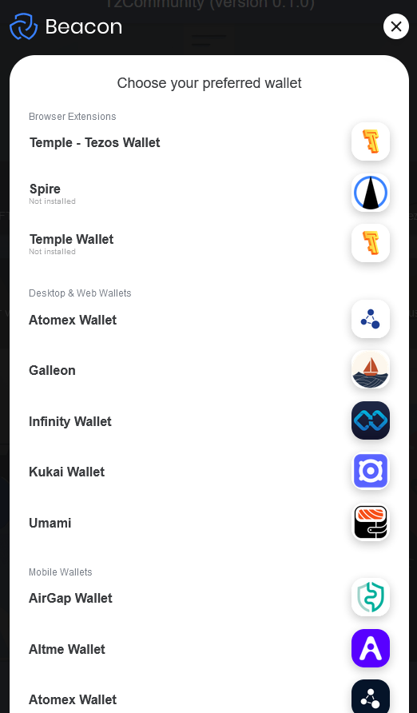
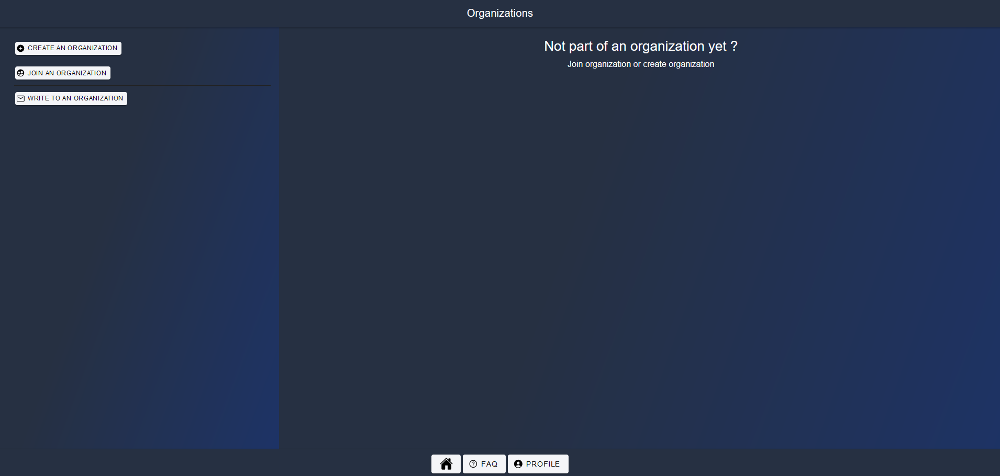
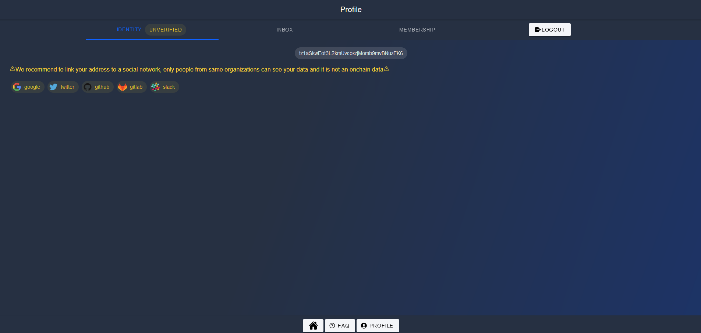
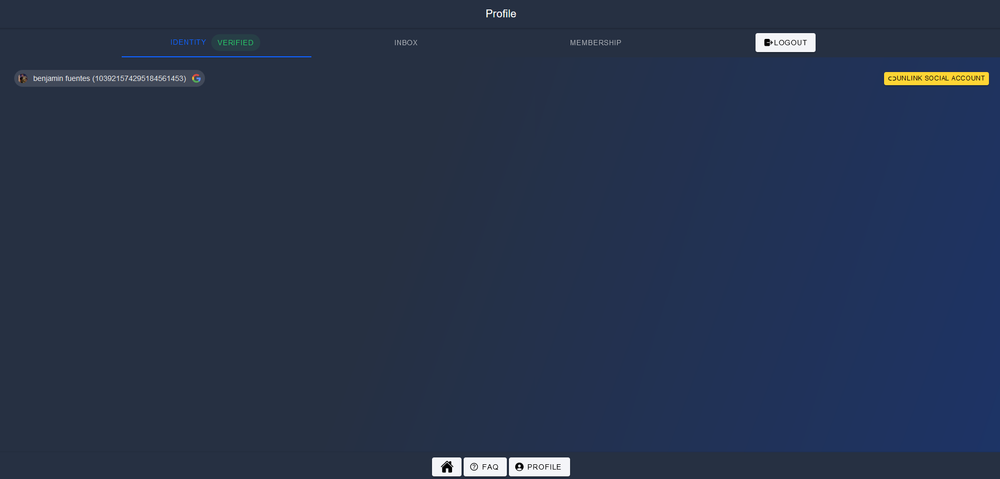
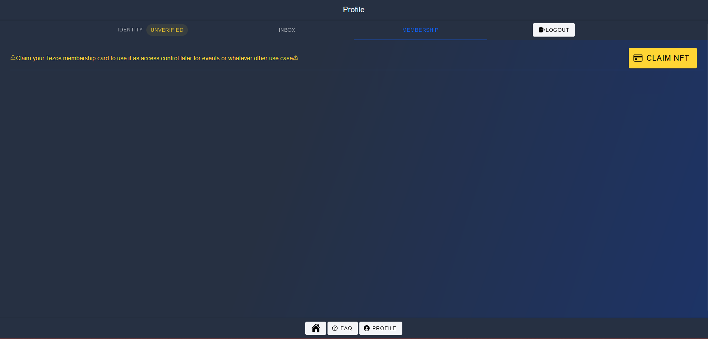
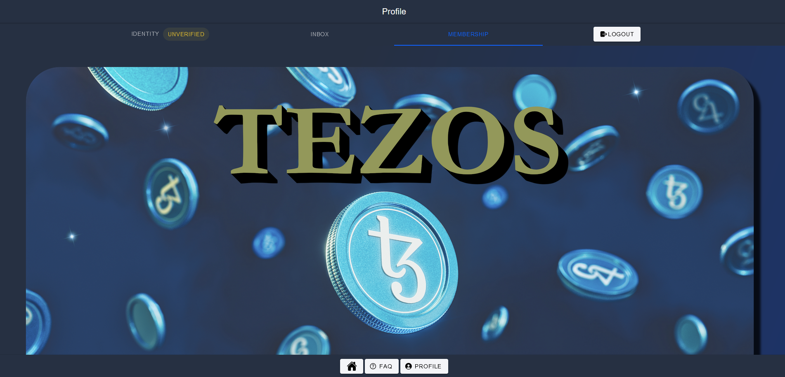

# Login

Open/Connect to [Tezos community](https://tezos-community.com)

Your identity is your wallet account

Click on **Connect your wallet** and select your preferred wallet and account

# Link

You can choose to link your profile with one of the listed social account. If you do so, other people from same group are able to see your real name and picture. It will improve human readable identities for others third party applications, messaging, etc ...

> Note : if you want to stay totally pseudonymous, don't do this step

Click on bottom button **Profile** and select of the social account you have

> Note : if your social account does not exist on the list , please send an email to [benjamin.fuentes@marigold.dev](mailto:benjamin.fuentes@marigold.dev)

Once you confirm all intermediate popups, your Tezos address will now appear with the social account information

You can unlink social account at any time clicking on button **UNLINK SOCIAL ACCOUNT**

# Claim NFT membership card

On MEMBERSHIP tab, you can claim your Tezos NFT membership card for free

It can be used later for loyalty programs, access token, etc ...

Click on **CLAIM NFT** button

# Logout

On top right corner of Profile menu, click on **LOGOUT** button to disconnect your wallet
