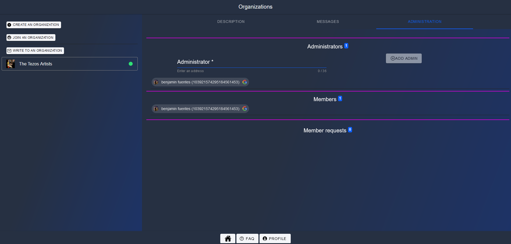
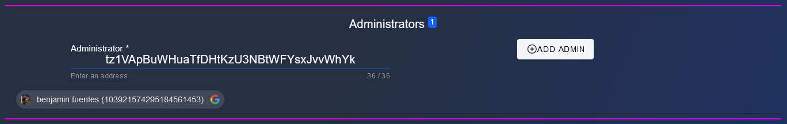
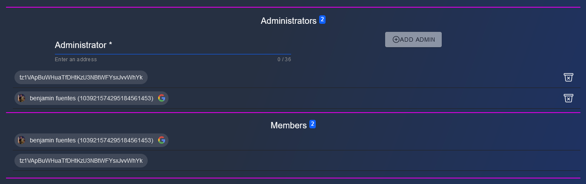
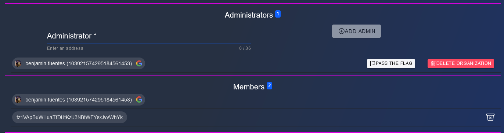

# Manage an organization

If you are administrator, on your Organization page, the last tab lets you manage your org

## Administrators

### Add administrator

Enter the address of someone you want to invite as administrator and click on **ADD ADMIN**

Once confirmed he/she will appear on both admin and member

## Delete admin

Click on the trash to delete an admin

Now you are the only admin.

> Note : as there is at least 1 member on your organization (that is not you), you can pass the admin flag to another member or either decide to delete your organization

## Members

Users can be added only if :

- they send a request to join and are accepted (with AutoRegistration to false)
- they send a request to join (with AutoRegistration to true)
- they are no more admins

You can only remove a user from organization, no other action are possible.

## To remove a user

Click on the trash icon

## Member requests

To have member requets, you need someone to send a join request, see [this chapter for more details](JoinAnOrganization.md)

When you have user, you can approve/decline in batch

//TODO
