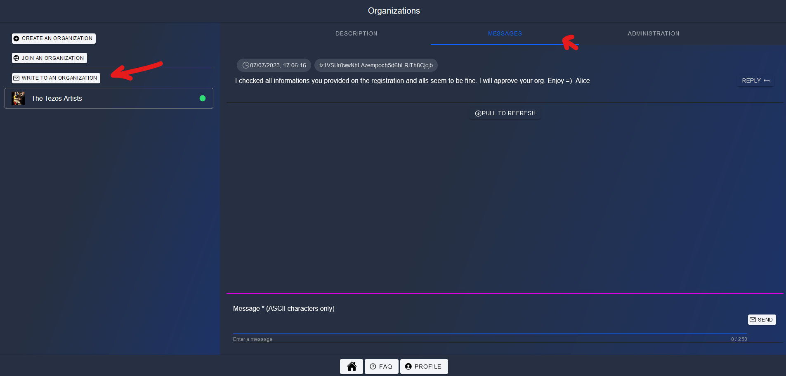
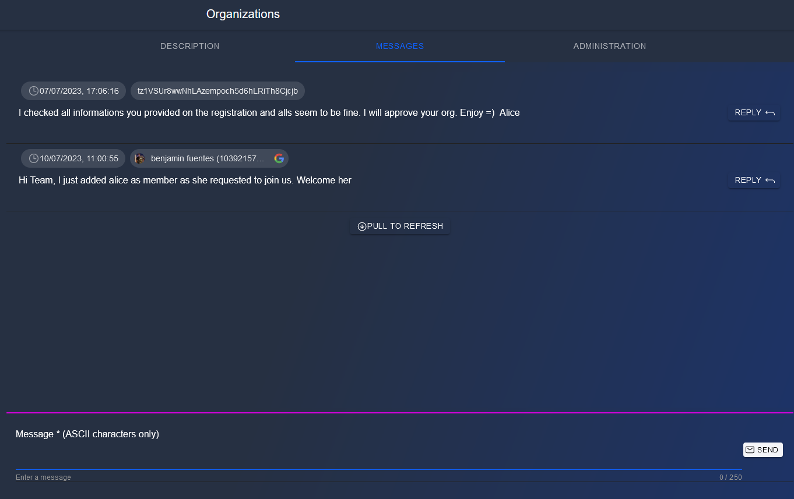
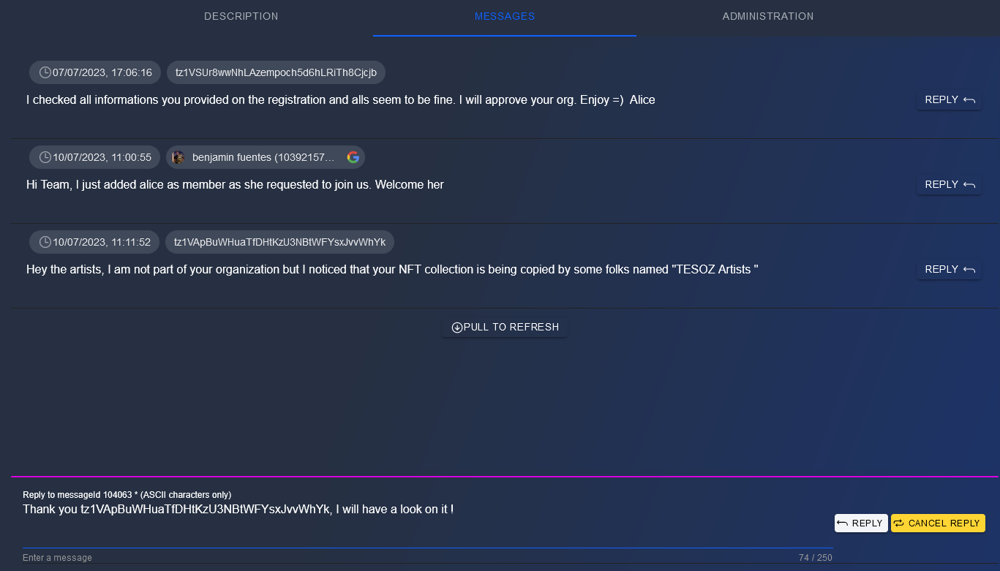
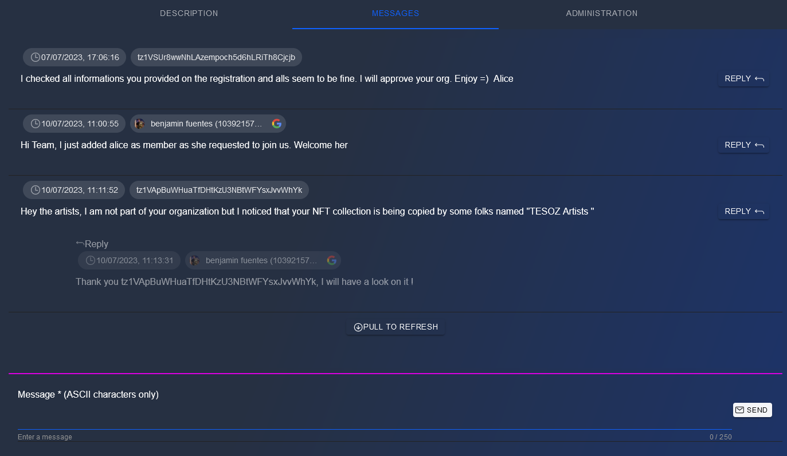

# Write to an organization

Any user can write to an organization, being part of it or not but ... he/she will have to pay gas fees. The reason is that we want to avoid spammers and we want to make these alerts/messages appearing as important information

# Write

You can either click on the button **WRITE TO ORGANIZATION** on Home/Organization page or on the **MESSAGES** tab of your organization

Write your message (respecting ASCII characters) and click on **SEND** button

# Reply

If someone send a message and is not part of the organization, he/she cannot see the answers. To tackle this issue, any user can decide to **reply** to a message.

Click on **REPLY** on a specific message and add your text there, then click on **REPLY** button

## Watch replies in thread

If you are part of the organization, you can vizualize all thread and replies

## Watch replies on inbox

If you are not part of the organization, you can vizualize replies to your messages on your Profile > Inbox tab

